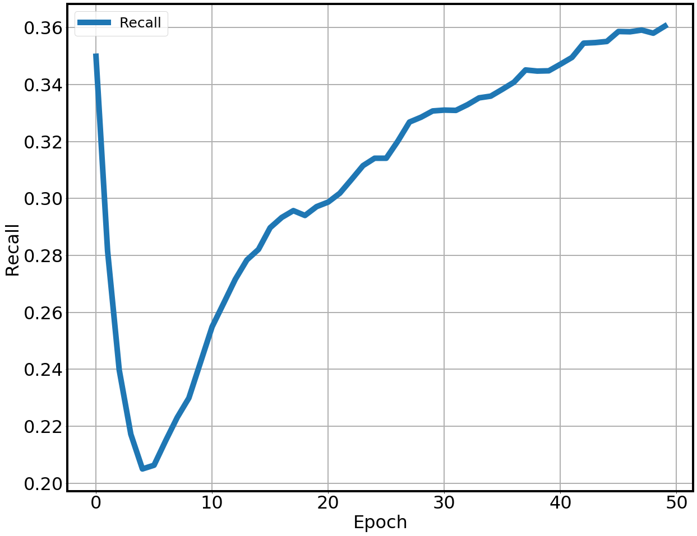

# CNN-ED

This is the implementation of the paper "Xinyan DAI, Xiao Yan, Kaiwen Zhou, Yuxuan Wang, Han Yang, and James Cheng. Convolutional Embedding for Edit Distance. SIGIR 2020"

## Get Start
### Requirement
```
pip3 install -r requirements.txt
```

### Train
```
python3 main.py --c config/config.yml
```

## Results
### Training loss

### Validation recall

